# Deployment in AWS

Dieser Abschnitt beschreibt die Installation von TLJH in einer VM von AWS und den anschließenden Zugriff auf die TLJH-Programmierumgebung über einen Browser und Internet. In diesem Abschnitt wird auch beschrieben, wie man die häufig verwendete Jupyterlab-extension installiert und die echtzeitige kollaborative Arbeit ermöglichen.

## Konfiguration VM von AWS

Dieser Abschnitt beschreibt, wie Sie VMs für eine Gruppe konfigurieren. Wenn es 10 Gruppen für das gesamte Projekt gibt, dann sollten Sie 10 identische VMs konfigurieren. Voraussetzung ist, dass Sie ein AWS-Konto haben.

1.	Einloggen in die AWS Konsole mit Ihrem AWS-Konto
2.	Suchen Sie nach EC2 und wählen Sie es im Suchfeld aus. Dies führt Sie zur EC2 Management Konsole.
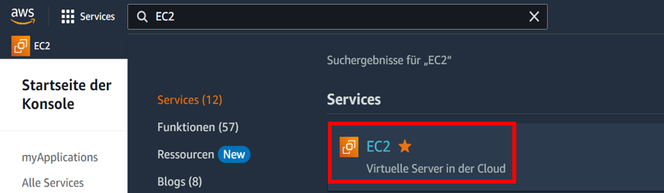
3.	Wählen Sie im Navigationsmenü ganz links in der EC2-Verwaltungskonsole die Option Instances unter der hellgrauen Unterüberschrift INSTANCES.
4.	Klicken Sie im Hauptfenster der EC2 Management Console oben rechts auf die orange Schaltfläche Instance starten.
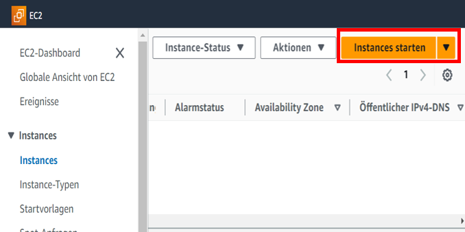
Im Schritt "Launch an Instance" konfigurieren Sie die für TLJH benötigte VM
5.	Oben rechts das richtige Region für VM auswählen. Der Preis und die Verzögerung sind die wichtigsten Faktoren bei der Auswahl einer Region.
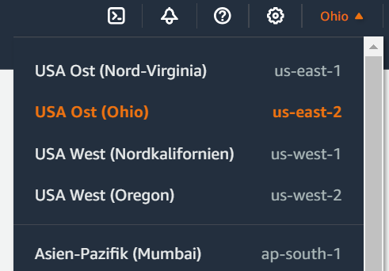
6.	Geben Sie Ihrer VM einen Namen. In diesem Beispiel ist diese VM für Gruppe 1 konfiguriert. Jede Gruppe verwendet eine VM.
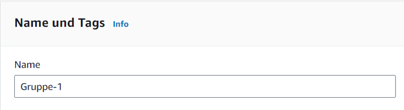
7.	Wählen Sie Ubuntu 22.04 oder 20.04 als Betriebssystem und x86 als Architektur.
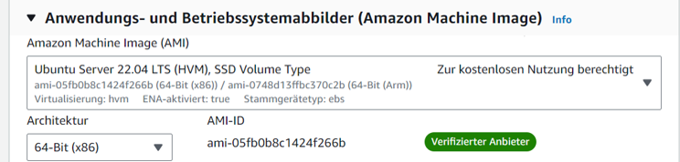
8.	Wählen Sie den Instance-Typ entsprechend dem für das Projekt erforderlichen Rechenaufwand. In diesem Fall wurde r5a.xlarge gewählt.
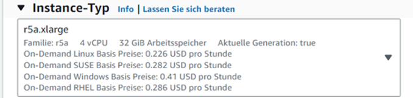
Schauen Sie sich auf https://tljh.jupyter.org/en/latest/howto/admin/resource-estimation.html zur Schätzung des Speicher-, CPU- und Festplattenbedarfs an, um herauszufinden, wie viel Speicher und CPU Ihr Server benötigt.
9.	Erstellen Sie ein neues RSA-Typ Schlüsselpaar mit .pem Format und speichern Sie es in einem lokalen Ordner. Sie wird es in der SSH-Verbindung Prozess verwendet.
10.	Wählen Sie bei der Netzwerkeinrichtung Neue Sicherheitsgruppe erstellen und den Zugriff über HTTP und HTTPs zu erlauben.
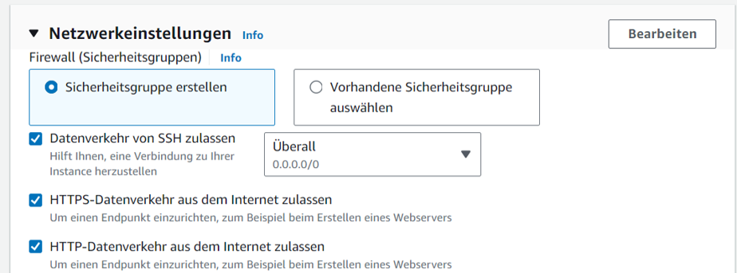
11.	Aus Kostengründen, wählen Sie eine 8-GB-Magnetfestplatte als Speicher.
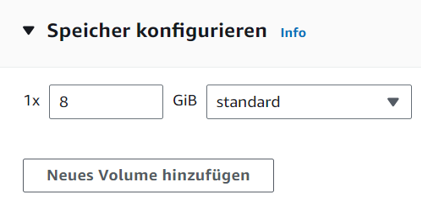
12.	Fügen Sie die folgenden Konfigurationsdaten ganz unten in die Benutzerdaten in den erweiterten Details ein.
#!/bin/bash
curl -L https://tljh.jupyter.org/bootstrap.py \
  | sudo python3 - \
--admin Admin
13.	Klicken Sie unten rechts auf die orange Schaltfläche Instance starten.
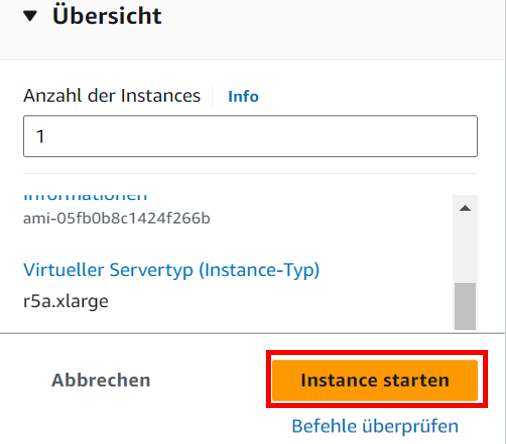
14.	Wählen Sie im Navigationsmenü ganz links in der EC2-Verwaltungskonsole die Option EC2-Dashboard. Sie können die soeben erstellte Instanz sehen. Klicken Sie im Bereich Reessourcen auf die Option Instanzen.
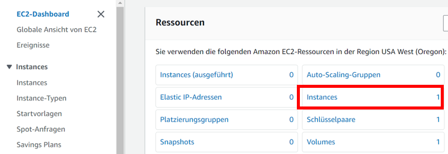
15.	Klicken Sie auf die ID der Instanz, die Sie gerade erstellt haben
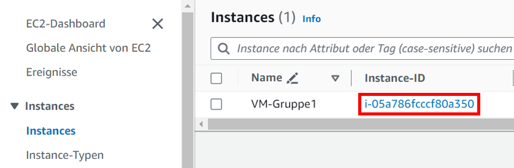
16.	Sie können die aktuellen Informationen für die Instanz sehen. Wenn Sie die öffentliche IPv4-Adresse in Ihren Browser einfügen, können Sie auf TLJH in der virtuellen Maschine zugreifen.
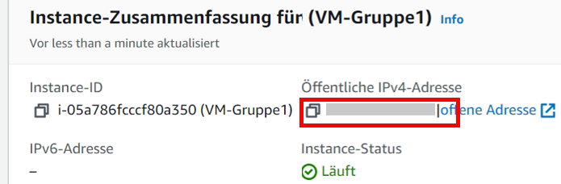
Diese IPv4-Adresse ist dynamisch, und AWS weist dieser VM bei jedem Start eine neue Adresse zu.
17.	Mit dieser IPv4-Adresse können Sie auf den Login-Bildschirm des TLJH zugreifen. Der Benutzername ist Admin. Das Passwort ist der, den Sie beim ersten Mal eingegeben haben.

2.2	Integration in databrix.org
databrix.org ist die Online-Kursplattform für Studierende. Beschreibungen von Kursen und praktischen Projekten können über diese URL aufgerufen werden. TLJH, die Programmierplattform, sollte ebenfalls über diese URL zugänglich sein. Die Studierenden sollten in der Lage sein, die VM zu starten und über eine Schaltfläche auf dieser Website auf das zu ihrer Gruppe gehörende TLJH zuzugreifen. Wenn der Benutzer auf die Schaltfläche klickt, wird das folgende Python-Skript aufgerufen, um die Programmierplattform zu starten.
https://github.com/databrix-org/demo-databrix.org-yuqiang/blob/main/LaunchVM.py
