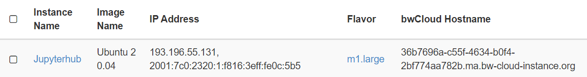
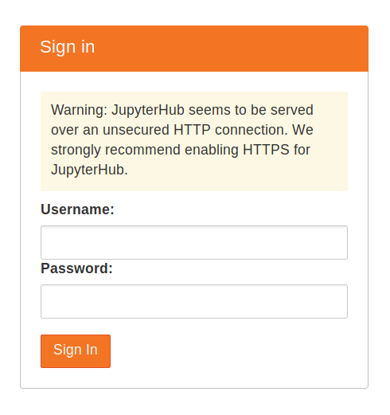

# Deployment in bwCloud

Dieser Abschnitt beschreibt den Prozess der Anfrage VM-Instanzen in bwCloud und die Schritte zur Installation von TLJH.

## Installation TLJH in VM von bwCloud

Jedes Team verwendet ein TLJH und ein VM. Wenn Sie also 10 Gruppen haben, sollten Sie die gleichen Installationsschritte auf 10 VMs wiederholen.
1.	SSH in Ihre VM
2.	Stellen Sie sicher, dass Sie python3, python3-dev, curl und git installiert haben.
```js
sudo apt install python3 python3-dev git curl
```
3.	Kopieren Sie den unten stehenden Text und fügen Sie ihn in das Terminal ein. Dieser Admin-Benutzer kann sich nach der Einrichtung des JupyterHub anmelden und ihn nach seinen Bedürfnissen konfigurieren.
```js
curl -L https://tljh.jupyter.org/bootstrap.py | sudo -E python3 - --admin Admin
```
4.	Drücken Sie die Eingabetaste, um den Installationsvorgang zu starten. Der Vorgang dauert 5-10 Minuten. Nach Abschluss der Installation wird die Meldung Fertig! angezeigt.
5.	Kopieren Sie die öffentliche IPv4 Adresse ihres Servers und versuchen Sie, von Ihrem Browser aus auf http://<public-ip> zuzugreifen. Wenn alles gut gelaufen ist, sollten Sie nun eine Anmeldeseite für JupyterHub erhalten.

6.	Melden Sie sich mit dem Benutzernamen „Admin“ an, den Sie in Schritt 3 eingestellt haben. Sie können ein beliebiges Passwort wählen. Verwenden Sie ein sicheres Passwort und notieren Sie es irgendwo, da dies von nun an das Passwort für das Admin-Benutzerkonto sein wird!


## Integration in databrix.org

databrix.org ist die Online-Kursplattform für Studierende. Beschreibungen von Kursen und praktischen Projekten können über diese Webseite aufgerufen werden. TLJH, die Programmierplattform, sollte ebenfalls über diese URL zugänglich sein. Die Studierenden sollten in der Lage sein, über eine Schaltfläche auf dieser Website auf das zu ihrer Gruppe gehörende TLJH zuzugreifen. Wenn der Benutzer auf die Schaltfläche klickt, wird das spezifische URL Link geöffnet, um die Programmierplattform zu starten.