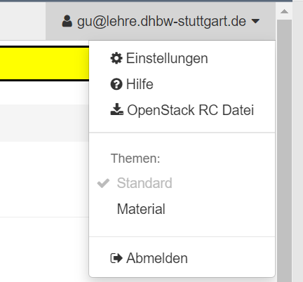
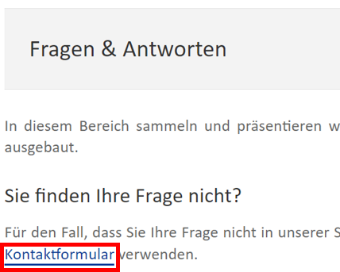

# Deployment in bwCloud

Dieser Abschnitt beschreibt den Prozess der Anfrage VM-Instanzen in bwCloud und die Schritte zur Installation von TLJH.

## Anfrage VM-Instanzen

Voraussetzung für die Anfrage ist, dass Sie ein bwCloud-Konto haben. Mit einem bwCloud-Konto können Sie nur eine VM mit einer vCPU und 1 GB RAM starten. Das ist für die meisten Projekte nicht genug. Daher müssen Sie bei den Mitarbeitern weitere Berechtigungen beantragen. Die folgenden Schritte helfen Ihnen bei der Anfrage nach weiteren VMs.
1.	Anmelden bei bwClouds Dashborad https://portal.bw-cloud.org/auth/login/
2.	Oben rechts auf dem Dashboard steht Ihre E-Mail-Adresse. Klicken Sie auf Ihre E-Mail-Adresse und wählen Sie Hilfe.

3.	Wählen Sie Kontaktformular im Feld Frage und Antwort.

4.	Wählen Sie es, dass Sie ein Gruppen Projekt einrichten möchten, und schreiben Sie ein Ticket.

5.	Bitte geben Sie im Ticket eine kurze Beschreibung Ihres Projekts an. Und beantragen Sie die benötigten VMs unter Verwendung des folgenden Formats. Derzeit kann bwCloud die folgenden Flavors anbieten. (Siehe https://www.bw-cloud.org/de/bwcloud_scope/flavors)
a) Ihre OpenStack User-UUID.
b) Warum Sie die Quota benötigen.
c) Die existierende ziel (Gruppen-)Projekt UUID.
d) Welche Resourcen benötigen Sie.
e) Wie lange Sie die Resourcen benötigen.
f) Welche(s) Flavor(s) möchten Sie nutzen.
SUBJECT: NEW_QUOTA 
MOTIVATION: TEXT 
USER_UUID: UUID 
PROJECT_UUID: UUID 
NUMBER_VM: NUMMER 
RAM_GB: NUMMER 
VCPU: NUMMER 
MEMORY_GB: NUMMER 
FLAVORS: NAME, NAME 
SPECIAL_QUOTA: TEXT 
CUT_OFF_DATE: DD.MM.YYYY
6.	Sobald das Projekt genehmigt ist, sehen Sie Ihr neues Projekt in der oberen linken Ecke des Dashboards. In diesem Projekt haben Sie die Berechtigung, weitere VMs zu öffnen.

## Installation TLJH in VM von bwCloud

Jedes Team verwendet ein TLJH und ein VM. Wenn Sie also 10 Gruppen haben, sollten Sie die gleichen Installationsschritte auf 10 VMs wiederholen.
1.	SSH in Ihre VM
2.	Stellen Sie sicher, dass Sie python3, python3-dev, curl und git installiert haben.
sudo apt install python3 python3-dev git curl
3.	Kopieren Sie den unten stehenden Text und fügen Sie ihn in das Terminal ein. Dieser Admin-Benutzer kann sich nach der Einrichtung des JupyterHub anmelden und ihn nach seinen Bedürfnissen konfigurieren.
curl -L https://tljh.jupyter.org/bootstrap.py | sudo -E python3 - --admin Admin
4.	Drücken Sie die Eingabetaste, um den Installationsvorgang zu starten. Der Vorgang dauert 5-10 Minuten. Nach Abschluss der Installation wird die Meldung Fertig! angezeigt.
5.	Kopieren Sie die öffentliche IPv4 Adresse ihres Servers und versuchen Sie, von Ihrem Browser aus auf http://<public-ip> zuzugreifen. Wenn alles gut gelaufen ist, sollten Sie nun eine Anmeldeseite für JupyterHub erhalten.

6.	Melden Sie sich mit dem Benutzernamen „Admin“ an, den Sie in Schritt 3 eingestellt haben. Sie können ein beliebiges Passwort wählen. Verwenden Sie ein sicheres Passwort und notieren Sie es irgendwo, da dies von nun an das Passwort für das Admin-Benutzerkonto sein wird!

## Integration in databrix.org

databrix.org ist die Online-Kursplattform für Studierende. Beschreibungen von Kursen und praktischen Projekten können über diese Webseite aufgerufen werden. TLJH, die Programmierplattform, sollte ebenfalls über diese URL zugänglich sein. Die Studierenden sollten in der Lage sein, über eine Schaltfläche auf dieser Website auf das zu ihrer Gruppe gehörende TLJH zuzugreifen. Wenn der Benutzer auf die Schaltfläche klickt, wird das spezifische URL Link geöffnet, um die Programmierplattform zu starten.