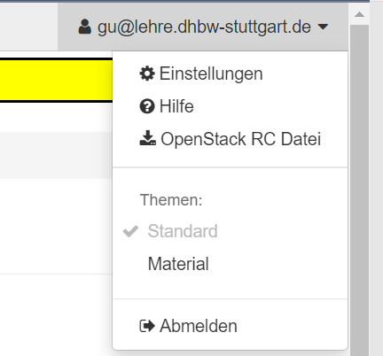
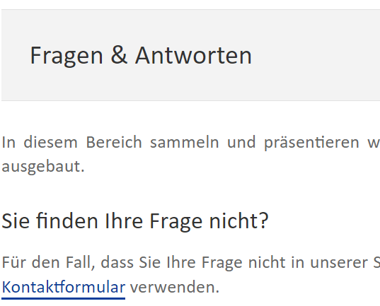
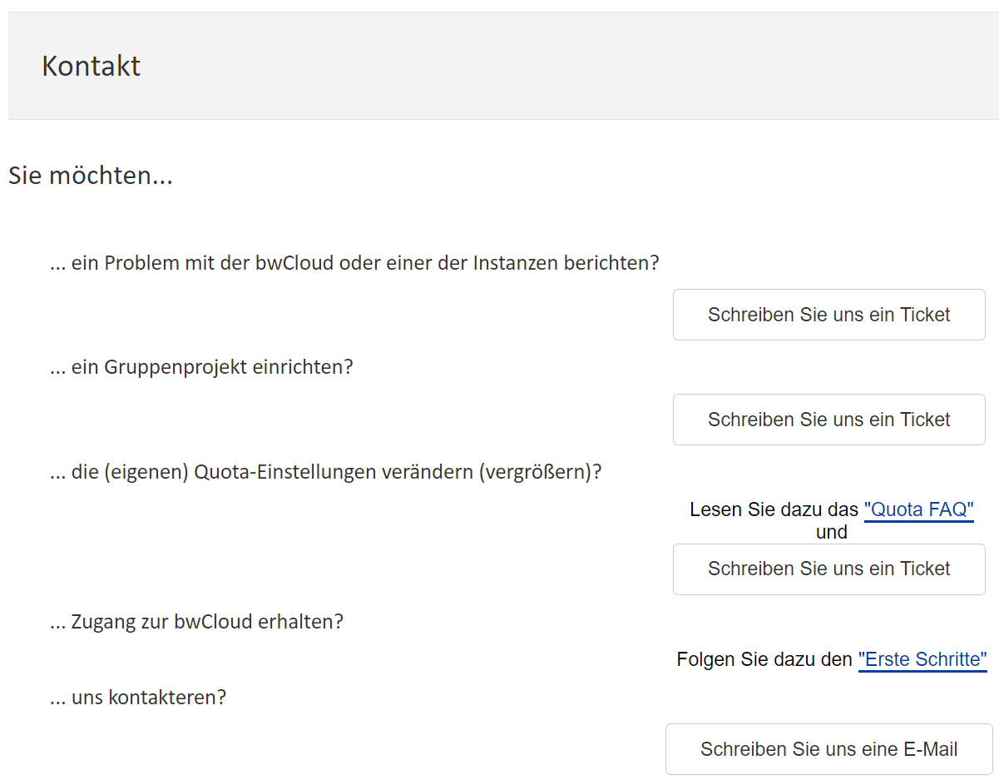
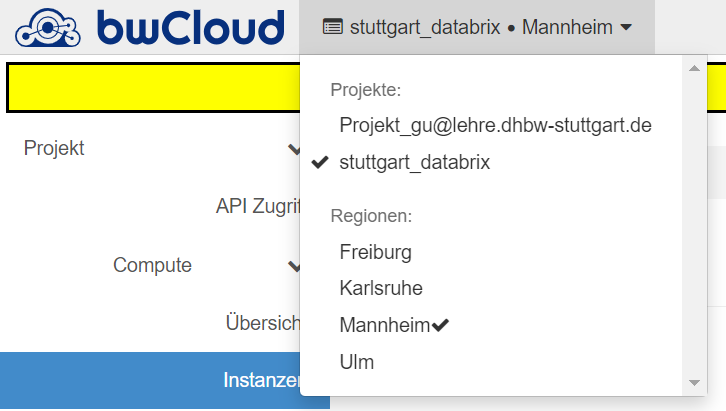

# Anfrage VM-Instanzen

Voraussetzung für die Anfrage ist, dass Sie ein bwCloud-Konto haben. Mit einem bwCloud-Konto können Sie nur eine VM mit einer vCPU und 1 GB RAM starten. Das ist für die meisten Projekte nicht genug. Daher müssen Sie bei den Mitarbeitern weitere Berechtigungen beantragen. Die folgenden Schritte helfen Ihnen bei der Anfrage nach weiteren VMs.
1.	Anmelden bei bwClouds Dashborad https://portal.bw-cloud.org/auth/login/
2.	Oben rechts auf dem Dashboard steht Ihre E-Mail-Adresse. Klicken Sie auf Ihre E-Mail-Adresse und wählen Sie Hilfe.

3.	Wählen Sie Kontaktformular im Feld Frage und Antwort.

4.	Wählen Sie es, dass Sie ein Gruppen Projekt einrichten möchten, und schreiben Sie ein Ticket.

5.	Bitte geben Sie im Ticket eine kurze Beschreibung Ihres Projekts an. Und beantragen Sie die benötigten VMs unter Verwendung des folgenden Formats. Derzeit kann bwCloud die folgenden Flavors anbieten. (Siehe https://www.bw-cloud.org/de/bwcloud_scope/flavors)
a) Ihre OpenStack User-UUID. /n
b) Warum Sie die Quota benötigen. /n
c) Die existierende ziel (Gruppen-)Projekt UUID. /n
d) Welche Resourcen benötigen Sie. /n
e) Wie lange Sie die Resourcen benötigen. /n
f) Welche(s) Flavor(s) möchten Sie nutzen. /n
```js copy
SUBJECT: NEW_QUOTA 
MOTIVATION: TEXT 
USER_UUID: UUID 
PROJECT_UUID: UUID 
NUMBER_VM: NUMMER 
RAM_GB: NUMMER 
VCPU: NUMMER 
MEMORY_GB: NUMMER 
FLAVORS: NAME, NAME 
SPECIAL_QUOTA: TEXT 
CUT_OFF_DATE: DD.MM.YYYY
```
6.	Sobald das Projekt genehmigt ist, sehen Sie Ihr neues Projekt in der oberen linken Ecke des Dashboards. In diesem Projekt haben Sie die Berechtigung, weitere VMs zu öffnen.
