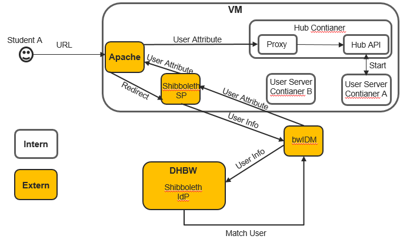

# Technische Überblick
JD verwendet Docker, um eine schnelle Bereitstellung von Data Science Lab auf einer einzigen virtuellen Maschine (VM) zu ermöglichen. Im Gegensatz zu TLJH ist bei JD keine umfangreiche Konfiguration auf VM erforderlich. Durch die Verwendung eines bereits konfigurierten Docker-Images entfällt für Administratoren die Notwendigkeit, mühsame Konfigurationen und Installationen auf jeder VM zu wiederholen. Dieser Artikel dokumentiert, wie JD deployed werden kann. 
Geeignete Anwendungsszenarien für den Einsatz von JD sind die an den baden-württembergischen Hochschulen eingerichteten Kurse. Solche Kurse haben oft mehrere Dutzend Teilnehmer und werden in Gruppen aufgeteilt. Jede Gruppe und jeder Teilnehmer muss die gleichen Aufgaben erledigen und die gleiche Programmierumgebung verwenden. Daher kann JD mit den konfigurierten Programmierumgebungen und den Aufgaben im Docker-Image die Bedürfnisse der Studierenden und Gruppen erfüllen.
Jedes Team hat eine eigene VM. Zwei Sorten von Docker Container werden auf dieser VM ausgeführt. Der Hub Container führt ein konfiguriertes Docker Image von Jupyterhub aus. Die Aufgaben dieses Containers ist es, Login-Anfragen zu bearbeiten und Workspace zu starten/stoppen. Workspace hingegen ist eine Jupyterlab-Anwendung, wie wir sie normalerweise auf unseren eigenen Computern verwenden. Hier wird Jupyterlab in Container geladen. Und jeder Benutzer hat einen eigenen. Die nachstehende Abbildung zeigt, wie JD funktioniert.

Ein Benutzer sendet eine Anfrage von einem Browser, um sich bei seinem Workspace anzumelden. Der Proxy „Apache“ ist in der Lage, Anfragen über die Port 80 und 443 der VM zu empfangen und leitet sie an Shibboleth Service Provider (SP) weiter, die den Benutzer authentifiziert. Nach der Authentifizierung kann Jupyterhub den zum Benutzer gehörenden Workspace starten und die URL des Workspace an den Proxy weiterleiten. Proxy leitet Benutzer zum Workspace um.